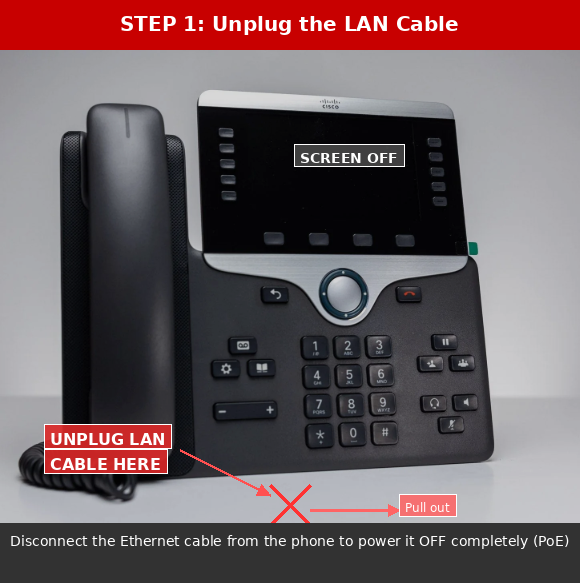
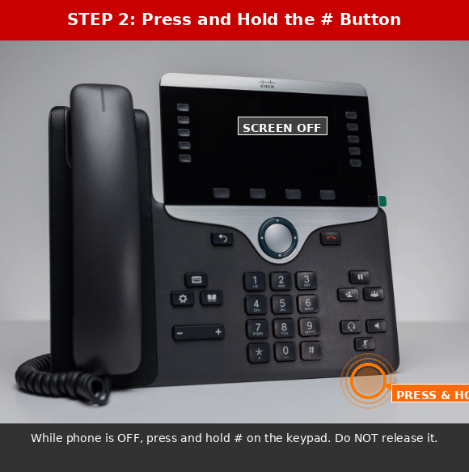
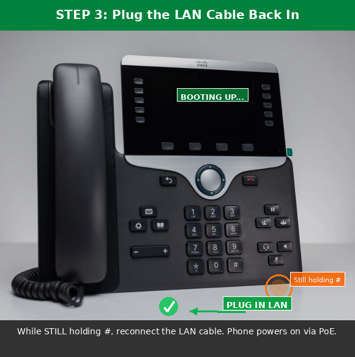
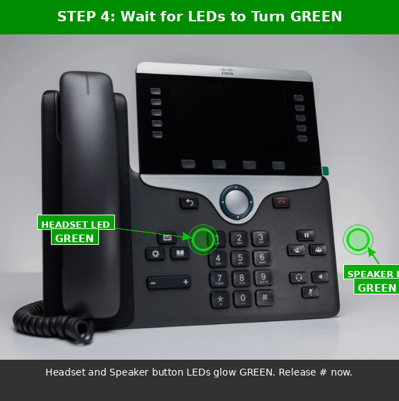
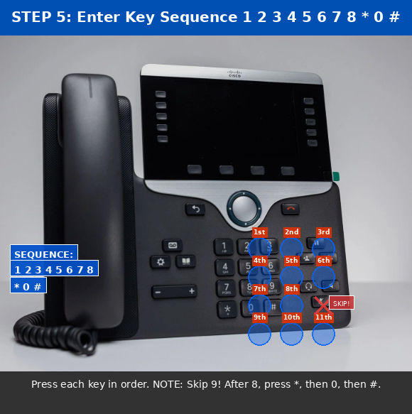
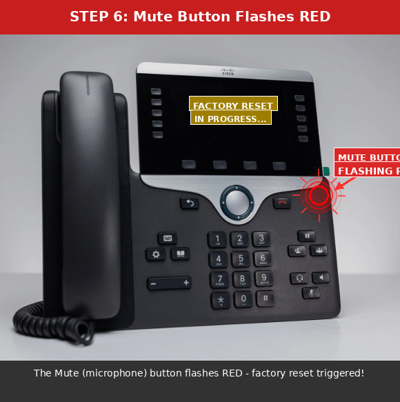
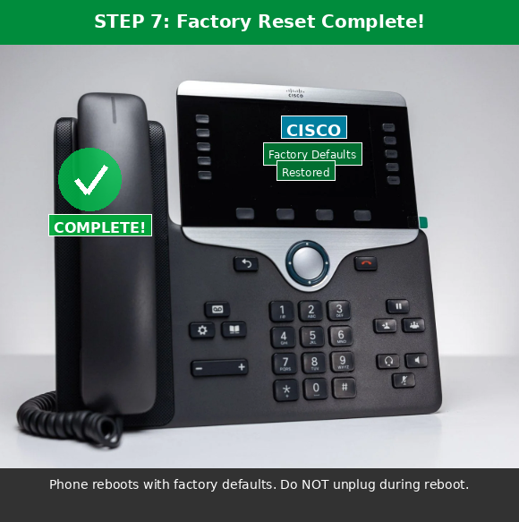

# Cisco SIP Phone 8851 - Hard Factory Reset Guide

> **Purpose:** This guide walks you through performing a hard factory reset on a **Cisco IP Phone 8851 (SIP)** using the LAN cable power cycle method. This procedure erases all user settings, network configurations, and restores the phone to its original factory defaults.

---

## Prerequisites

- A **Cisco IP Phone 8851** powered via **PoE** (Power over Ethernet)
- Physical access to the **LAN (Ethernet) cable** connected to the phone
- No external power adapter required (PoE powers the phone through the LAN cable)

---

## Quick Reference

| Step | Action |
|------|--------|
| 1 | Unplug the LAN cable |
| 2 | Press and hold **#** |
| 3 | Plug the LAN cable back in (while holding **#**) |
| 4 | Wait for **Headset** and **Speaker** LEDs to glow **GREEN** |
| 5 | Enter key sequence: **1 2 3 4 5 6 7 8 * 0 #** |
| 6 | **Mute** button flashes **RED** |
| 7 | Factory reset complete - phone reboots |

---

## Step-by-Step Instructions

### Step 1: Unplug the LAN Cable

Disconnect the **LAN (Ethernet) cable** from the back of the Cisco 8851 phone. Since the phone is powered via PoE, removing the LAN cable will **completely power off** the phone.



> **Key Point:** The phone screen must be completely **OFF** before proceeding.

---

### Step 2: Press and Hold the # Button

While the phone is **powered off**, locate the **#** (hash/pound) button on the keypad and **press and hold it down**. Do **not** release the button.



> **Key Point:** Keep the **#** button held down throughout the next step.

---

### Step 3: Plug the LAN Cable Back In (While Holding #)

With the **#** button still held down, plug the **LAN cable** back into the phone. The phone will begin to **power on** via PoE.



> **Key Point:** Do **NOT** release the **#** button until the indicator lights turn green (next step).

---

### Step 4: Wait for Headset and Speaker LEDs to Turn GREEN

Continue holding the **#** button and watch for the **Headset** icon button (left side) and the **Speaker** icon button (right side) to light up **GREEN**. Once both LEDs glow green, **release the # button**.



> **Key Point:** Both the **Headset** and **Speaker** button LEDs must be **GREEN** before you release **#** and enter the key sequence.

---

### Step 5: Enter the Key Sequence: 1 2 3 4 5 6 7 8 * 0 #

Immediately after releasing the **#** button, press the following keys **in exact order**, one at a time:

```
1  2  3  4  5  6  7  8  *  0  #
```



> **WARNING:** The sequence is **1 2 3 4 5 6 7 8 * 0 #** - note that **9 is skipped**. After pressing **8**, press **\*** (asterisk), then **0**, then **#**.

---

### Step 6: Mute Button Flashes RED

After entering the correct key sequence, the **Mute** button (microphone icon) will begin to **flash RED**. This confirms that the factory reset process has been successfully triggered.



> **Key Point:** If the Mute button does **not** flash red, the sequence was entered incorrectly. You must **start over from Step 1**.

---

### Step 7: Factory Reset Complete

The phone will automatically **reboot** and restore all settings to **factory defaults**. The Cisco logo will appear on screen as the phone initializes with its default configuration.



> **Key Point:** Do **NOT** unplug the phone during the reboot process. Allow it to complete the full initialization.

---

## Troubleshooting

| Problem | Solution |
|---------|----------|
| LEDs did not turn green | Start over - unplug LAN, hold **#**, and re-plug LAN |
| Mute button did not flash red | Key sequence was wrong - restart from Step 1 |
| Phone did not reboot | Wait 2-3 minutes; if no response, repeat the process |
| Phone boots normally without reset | Ensure **#** was held **before** plugging in the LAN cable |

---

## Important Notes

- This reset erases **all** user data, speed dials, call history, and network settings
- The phone will need to be **re-provisioned** after the factory reset
- If the phone is registered to a **Call Manager (CUCM/CME)**, it will need to re-register
- Ensure you have the **TFTP/provisioning server** information ready for re-configuration

---

*Reference: Cisco IP Phone 8800 Series Administration Guide*
